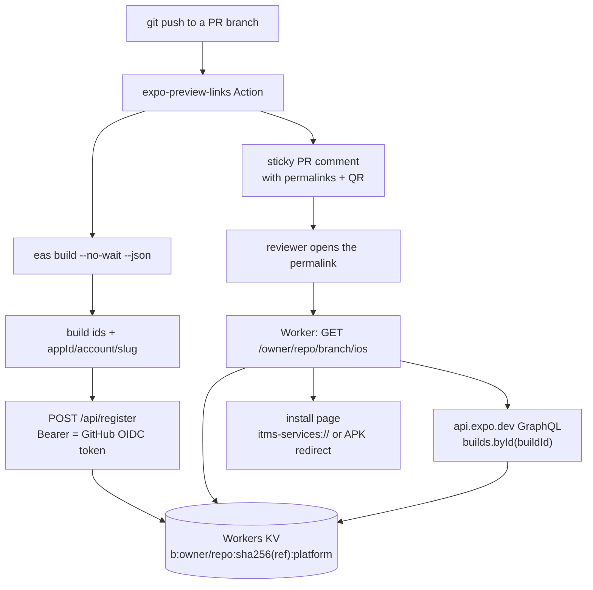

# expo-preview-links

Stable per-branch permalinks to the latest Expo (EAS) iOS and Android builds, posted as a sticky pull request comment.

One GitHub Action triggers the builds and one Cloudflare Worker serves the links. A reviewer opens
`https://<your-worker>/<owner>/<repo>/<branch>/ios` and gets whatever the newest build for that branch
is — today, tomorrow, and after three more pushes.

## The pull request comment

The Action upserts a single comment (identified by an HTML marker, so it is rewritten rather than
duplicated). The body is markdown plus the two `` and `<details>` elements GitHub allows:

```markdown
### 📱 Expo preview builds

Branch `feature/login` · commit `0123456` · profile `preview`

| | Platform | Status | Install | Scan |
|---|---|---|---|---|
| 🍎 | **iOS** `1.4.0` | 🟢 ready · [build log](https://expo.dev/accounts/acme/projects/app/builds/8a7b…) | **[Install](https://links.example.com/acme/app/feature/login/ios)** |  |
| 🤖 | **Android** `1.4.0` | 🟡 building | [Open](https://links.example.com/acme/app/feature/login/android) | — |

<details>
<summary>Permalinks & troubleshooting</summary>
…stable-link explanation, one bullet per platform, and the three
failure modes testers actually hit (in-app browser, UDID, expired).
</details>
```

The QR column only renders an image once a build is `ready`. The `?c=` parameter on the QR URL is read
by nobody: it changes on every comment rewrite so GitHub's camo proxy cannot serve a year-old image.

## Why a Worker?

EAS has no branch-to-build index — `BuildFilter` has no `gitRef`, and a CLI-triggered build does not
record one either, so "the latest build for branch X" is not a question the API can answer. That means a
link to a concrete build id goes stale the moment somebody pushes again. The Worker stores the
`branch → buildId` mapping at build time and resolves it against EAS at request time, so one URL keeps
pointing at the newest build forever. Artifacts also expire, which a baked-in artifact URL cannot
survive: the Worker notices and renders an explanation instead of a dead download.

## Flow



The Action never sends the owner, repo or branch — the Worker reads all three from the signed OIDC
claims. See [Security](#security).

## Quickstart

1. **Create the KV namespace.**

   ```sh
   pnpm install
   pnpm exec wrangler kv namespace create BUILDS
   ```

2. **Paste the printed id into `wrangler.jsonc`.** The field is `id`, not `namespace_id`:

   ```jsonc
   "kv_namespaces": [{ "binding": "BUILDS", "id": "0123456789abcdef0123456789abcdef" }],
   ```

3. **Deploy the Worker.**

   ```sh
   pnpm run deploy
   ```

4. **Copy the `*.workers.dev` URL** wrangler prints, e.g.
   `https://expo-preview-links.YOUR-SUBDOMAIN.workers.dev`. That is the `base-url` input.

5. **Add `EXPO_TOKEN` as a repository secret in your app repo.** Use an Expo **robot** token
   (Expo dashboard → account settings → Access tokens), not a personal one: a personal token acts as
   the human across every account and organisation they can reach. This secret is consumed by
   `expo/expo-github-action`, which installs and authenticates `eas-cli`.

6. **Add the workflow.** Copy [`examples/workflows/preview.yml`](examples/workflows/preview.yml) to
   `.github/workflows/preview.yml` in your app repo and set `base-url`:

   ```yaml
   permissions:
     contents: read        # checkout
     pull-requests: write  # post the sticky comment
     id-token: write       # mint the OIDC token the Worker verifies

   jobs:
     preview:
       if: github.event.pull_request.head.repo.full_name == github.repository
       steps:
         - uses: actions/checkout@v7
           with: { persist-credentials: false }
         - uses: actions/setup-node@v7
           with: { node-version: 22 }
         - run: npm ci
         - uses: expo/expo-github-action@v9
           with:
             eas-version: latest
             token: ${{ secrets.EXPO_TOKEN }}
         - uses: victorhenrion/expo-preview-links@v1
           with:
             base-url: https://expo-preview-links.YOUR-SUBDOMAIN.workers.dev
             platform: all
             profile: preview
   ```

   Your `eas.json` profile must be an internal-distribution profile — see
   [`examples/eas.json`](examples/eas.json). `distribution: "internal"` is the load-bearing setting: on
   Android it produces an installable APK instead of an `.aab`, on iOS an ad hoc build.

   On a free EAS plan use [`examples/workflows/preview-label-gated.yml`](examples/workflows/preview-label-gated.yml)
   instead, which only builds when the PR carries a `preview` label.

**Optional — `wrangler secret put EXPO_TOKEN` on the *Worker*.** The Worker asks EAS anonymously first,
which works while your Expo project has unauthenticated build access enabled (Expo's default for
internal distribution). Only set this secret if you have turned that off; without it the permalink
renders the `unavailable` page. This is separate from the repository secret in step 5.

## Routes

`<ref>` may contain slashes (`feature/login` stays readable in the path); `%`, `#`, `?` and `&` are
percent-encoded. Owner and repo are matched case-insensitively.

| Method | Path | Returns | Auth |
|---|---|---|---|
| `GET` | `/` | Landing page explaining the permalink shape. No KV read. | none |
| `GET` | `/healthz` | `{"ok":true}` | none |
| `GET` | `/<owner>/<repo>/<ref>/<ios\|android>` | HTML install page, always `200`, one of seven states. | public, or `?t=` when `GATING_MODE=signed` |
| `GET` | `/<owner>/<repo>/<ref>/<platform>.json` | `PointerStatusJson`: status, buildId, sha, appVersion, appIdentifier, buildPageUrl, expiresAt, error and queue fields. | same |
| `GET` | `/<owner>/<repo>/<ref>/<platform>/artifact` | `302` to the allow-listed artifact URL. `404 not_found` when nothing is registered, `404 not_ready`, `410 expired`, `502 artifact_host_not_allowed`. | same |
| `GET` | `/<owner>/<repo>/<ref>/<platform>/qr.png` | PNG QR of the canonical permalink. `Cache-Control: public, max-age=60`. | none — served before the gate |
| `GET` | `/<owner>/<repo>/<ref>/<platform>/qr.svg` | SVG QR, same payload. | none — served before the gate |
| `POST` | `/api/register` | `{ok, repository, ref, registered[]}`. Writes the KV pointers. | GitHub OIDC JWT in `Authorization: Bearer` |
| any other | any | `405` with `Allow: GET, HEAD`; unknown GET paths render a `404` page. | — |

Rate limits are per resource, never per IP: `RL_READ` 120/min per `owner/repo/ref/platform`,
`RL_REGISTER` 20/min per OIDC `repository_id`, `RL_BADAUTH` 10/min on failed auth.

A permalink never 404s. KV caches negative lookups for about a minute, so a miss renders a
self-refreshing `200` rather than a dead link for whoever clicks first.

## Action inputs

| Input | Required | Default | Description |
|---|---|---|---|
| `base-url` | yes | — | Origin of your deployed expo-preview-links Worker, e.g. `https://expo-preview-links.acme.workers.dev` |
| `platform` | no | `all` | Which platforms to build: `ios`, `android`, or `all`. |
| `profile` | no | `preview` | The `eas.json` build profile to use. Must be an internal-distribution profile. |
| `github-token` | no | `${{ github.token }}` | Token used to post the pull request comment. Needs `pull-requests: write`. |
| `comment` | no | `true` | Post/update the sticky pull request comment. |
| `cancel-superseded` | no | `true` | Cancel the in-flight EAS builds from this PR's previous push. Strongly recommended: free EAS plans stop building when the monthly quota is exhausted, and more than 50 pending builds per platform are rejected. |
| `wait-for-build` | no | `false` | Keep the job running until the builds finish, so the comment shows the final status. Costs CI minutes; the permalinks stay live either way. |
| `wait-timeout-minutes` | no | `40` | How long to wait when `wait-for-build` is true. |
| `refresh-ad-hoc-provisioning-profile` | no | `false` | Re-generate the iOS ad hoc provisioning profile so newly registered devices are included. The first thing to try when testers report "Unable to Install". Requires `EXPO_ASC_API_KEY_PATH`, `EXPO_ASC_KEY_ID` and `EXPO_ASC_ISSUER_ID` in the environment. |
| `working-directory` | no | `${{ github.workspace }}` | Directory containing `eas.json`. |
| `message` | no | PR number and title | Build message shown in the Expo dashboard. |

## Action outputs

| Output | Description |
|---|---|
| `comment-id` | Numeric id of the sticky pull request comment. |
| `comment-url` | HTML URL of the sticky pull request comment. |
| `ios-url` | Stable permalink to the latest iOS build for this branch. |
| `android-url` | Stable permalink to the latest Android build for this branch. |
| `ios-build-id` | EAS build id of the iOS build this run started. |
| `android-build-id` | EAS build id of the Android build this run started. |

## Worker configuration

Set in `wrangler.jsonc` under `vars`:

| Var | Default | Effect |
|---|---|---|
| `GATING_MODE` | `public` | `public`, or `signed` to require `?t=<expiry>.<hmac>` on read routes. |
| `OIDC_AUDIENCE` | the Worker's own origin | Expected `aud` claim. Only needed behind a proxy or a second hostname. |
| `ALLOWED_REPOS` | any repo (TOFU-bound) | Comma-separated `owner/repo` allowlist for `/api/register`. |
| `ALLOW_SELF_HOSTED` | `false` | Accept tokens whose `runner_environment` is not `github-hosted`. |
| `REQUIRED_JOB_WORKFLOW_REF` | unset | Pin registration to one workflow file, e.g. `acme/app/.github/workflows/preview.yml`. |
| `ALLOWED_ARTIFACT_HOSTS` | `expo.dev,api.expo.dev` | Hosts the Worker will redirect to. Exact match. |

Secrets (`wrangler secret put NAME`, never in the config file): `EXPO_TOKEN` (optional, see Quickstart)
and `PERMALINK_HMAC_SECRET` (only for `GATING_MODE=signed`).

## Security

**No secret is stored for the Worker.** Registration is authenticated with a GitHub OIDC token minted at
job runtime and verified against `token.actions.githubusercontent.com`, with the audience defaulting to
the Worker's own origin. A consuming repo therefore stores only the `EXPO_TOKEN` it needs anyway.

**A signature is authentication, not authorization.** Any repository on GitHub can mint a validly signed
token. What authorises a write is the trust-on-first-use binding: the first repo to register
`<owner>/<repo>` binds its numeric `repository_id` and `repository_owner_id` to that namespace, and
every later write must match. Numeric ids are used deliberately — they survive renames, and they stop
someone who claims a freed org name from taking over its permalinks. To clear a binding (for example
after deleting and recreating the repository):

```sh
wrangler kv key delete --binding BUILDS "r:<owner>/<repo>"
```

The owner, repo and branch are read from the verified claims, never from the request body; the body
carries only build descriptors and display-only metadata (PR number, commit sha, message).
`event_name` must be one of `pull_request`, `push`, `workflow_dispatch`, `merge_group`, and self-hosted
runners are rejected unless `ALLOW_SELF_HOSTED=true`.

**Fork pull requests are gated off, and `pull_request_target` is never used.** The example workflow
guards on `head.repo.full_name == github.repository` and the Action bails out again at runtime. GitHub
withholds secrets from fork PRs and caps `id-token` at `read`, so this path cannot work even in
principle. The tempting "fix" is `pull_request_target` — do not: it runs with repository secrets and a
write-scoped token, and `eas-cli` evaluates `app.config.js`, so it is arbitrary code execution from the
fork with `EXPO_TOKEN` in the environment. `examples/workflows/fork-notice.yml` posts an explanatory
comment instead, and reads only the event payload.

**Artifact host allowlist.** Artifact URLs are validated when stored *and* again immediately before any
`302`: https only, no embedded credentials, no IP literals, exact host match against
`ALLOWED_ARTIFACT_HOSTS`, and `expo.dev` URLs must live under `/artifacts/`. `endsWith("expo.dev")` is
not a substitute — `evilexpo.dev` passes that test.

**Optional signed permalinks.** With `GATING_MODE=signed` and `PERMALINK_HMAC_SECRET` set, every read
route except the QR images requires `?t=<expiryEpochSeconds>.<base64url-hmac>` over the canonical path,
and a missing secret fails closed. The default is `public` because it matches reality: Expo's own
internal-distribution URLs are available to anybody holding the URL, so gating this Worker alone buys
little and breaks one-tap install from the comment. Note that the Action does not currently emit signed
links — enabling `signed` means signing them yourself with the exported `signPermalink` helper.

Every branch name, commit message and EAS error string is attacker-controlled text: it is validated on
the way in (`git check-ref-format` rules) and HTML-escaped on the way out. Install pages are served with
`no-store`, a `default-src 'none'` CSP, `noindex` and `frame-ancestors 'none'`.

## Limits and gotchas

- **Preview builds are public by default.** This is not a weakening of Expo's model — it *is* Expo's
  model. Internal-distribution artifact URLs are available to anybody with the URL. Do not treat a
  preview link as confidential, and remember that PR comments are visible to everyone on a public repo.
- **iOS testers must have their UDID registered before the build.** An ad hoc provisioning profile bakes
  in the device list at build time. Register devices with `eas device:create`, then rebuild with
  `refresh-ad-hoc-provisioning-profile: true`. Apple caps ad hoc devices at 100 per device type per
  membership year, and the count resets only at renewal. A stale device list is the single most common
  cause of "Unable to Install".
- **EAS artifacts expire** (roughly 30 days, plan-dependent). The permalink does not break: it renders
  the `expired` page and tells the reader to push a commit. The same URL starts working again as soon
  as a new build lands.
- **Free EAS plans have an exhaustible monthly build quota with no overage**, and more than 50 pending
  builds per platform causes new builds to be **rejected outright**. That is why `cancel-superseded`
  defaults to `true`, and why the label-gated example workflow exists.
- **Simulator iOS builds cannot be installed on a phone.** If the build is a simulator build the page
  offers a download and an `eas build:run` command instead of an install button.
- **`api.expo.dev/graphql` is undocumented and unversioned.** The Worker's query is as narrow as
  possible and the resolver never throws into the request path — a breaking upstream change degrades to
  the `unavailable` page, which still links to expo.dev.

## Troubleshooting by state

The install page renders exactly seven states. The `.json` route returns the same `status` string.

| State | Page says | What to do |
|---|---|---|
| `no-pointer` | "No preview build yet" | Nothing is registered for this branch and platform. The page self-refreshes every 15s. If it never resolves: the job did not reach `POST /api/register` — check for a missing `id-token: write`, a fork PR, or a `repo_binding_mismatch` in the job log. |
| `building` | "Build in progress", with queue position and estimated wait when EAS reports them | Wait. EAS builds take roughly 10–25 minutes; the page refreshes every 30s. A long queue position on a free plan usually means concurrency, not a fault. |
| `ready` | "Install the … preview" | Tap Install. On iOS nothing happening almost always means an in-app browser (Slack, Gmail, Teams, Telegram) swallowing `itms-services://` — reopen in Safari. "Unable to Install" means the device UDID is not in the profile: `eas device:create`, then rebuild with `refresh-ad-hoc-provisioning-profile: true`. |
| `failed` | "Build failed", with the EAS `errorCode`, message and docs link | Open the build log on expo.dev. With `wait-for-build: true` the Action also fails the job and names the failing platforms. |
| `canceled` | "Build canceled" | Usually `cancel-superseded` doing its job after a newer push. Look for a newer preview on the PR, or push again. |
| `expired` | "This build has expired" | The artifact is gone from EAS. Push a commit; the same link resolves to the new build. |
| `unavailable` | "Could not reach EAS" | Either the Expo project has unauthenticated build access disabled and the Worker has no `EXPO_TOKEN` (`wrangler secret put EXPO_TOKEN`, a robot token), or EAS is temporarily unreachable. The expo.dev build link on the page still works. |

Other failure modes worth naming:

| Symptom | Cause |
|---|---|
| `Could not mint a GitHub OIDC token` | The job is missing `permissions: id-token: write`. |
| `repo_binding_mismatch` (403) | The namespace is bound to a different numeric repository id. Clear it with the `wrangler kv key delete` command above. |
| `self_hosted_runner` (403) | `runner_environment` is not `github-hosted`. Set `ALLOW_SELF_HOSTED=true` if that is intended. |
| `eas build failed: no eas.json found` | Set `working-directory`, or run `eas build:configure`. |
| The comment has no QR image | QR images only render in the `ready` state. |

## What this does not do

- **EAS Update previews.** This builds native binaries. For JS-only update previews (`eas update` plus a
  QR that opens in Expo Go or a dev client) use
  [`expo/expo-github-action/preview`](https://github.com/expo/expo-github-action).
- **Fingerprint gating.** It does not compute a native fingerprint to decide whether a new native build
  is required — every qualifying push builds. Gate that yourself with a path filter or the label-gated
  workflow.
- **Fork builds.** Deliberately impossible here, for the reasons in [Security](#security). If you need
  previews for outside contributors, use the EAS GitHub App's label-triggered build flow, which runs the
  build on Expo's side rather than inside your privileged workflow.

## Contributing

```sh
pnpm install
pnpm test                                  # vitest, worker + action projects
pnpm typecheck                             # tsc --noEmit
pnpm exec tsc --noEmit -p tsconfig.action.json
pnpm lint                                  # biome ci
pnpm format                                # biome check --write .
pnpm build                                 # rollup -> dist/index.js (committed)
pnpm dev                                   # wrangler dev
```

`dist/index.js` is committed and CI verifies it is in sync, so run `pnpm build` whenever you touch
`src/action/**` or `src/shared/**`.

## Licence

MIT. See [LICENSE](LICENSE).
